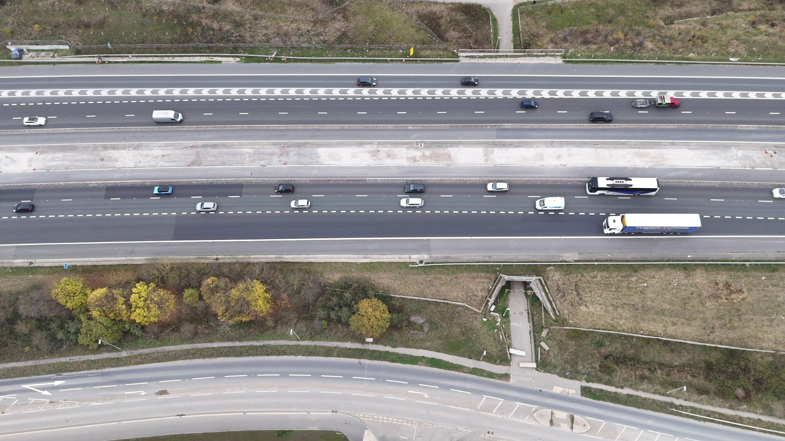
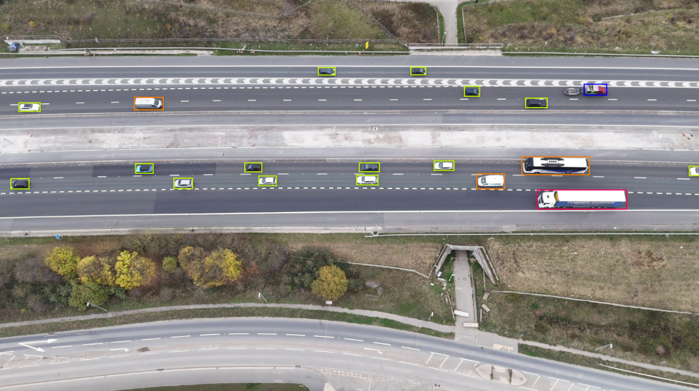

## Data Annotation Tool 🖼️✍️

A custom-built data annotation tool developed to make dataset preparation easier and more efficient for computer vision and AI projects.
This project was originally created as part of our work for Teknofest AI in Aviation and later improved for general-purpose usage.

  
  

  <b>Before</b> 🡒 <b>After</b>

## ✨ Features

✅ Simple and user-friendly interface for annotating images

✅ Supports bounding box creation for object detection tasks

✅ Saves annotations in structured formats (CSV/JSON)

✅ Allows image navigation and iterative labeling

✅ Lightweight and customizable

📂 Project Structure

veri_etiketleme_aracı.ipynb – Main Jupyter Notebook with the annotation interface

annotations/ – Folder where generated annotation files are stored

images/ – Input images for labeling

## 🚀 Getting Started

**1. Clone the repository**

git clone https://github.com/yusufdogu/data-annotation-tool.git

cd data-annotation-tool

**2. Install dependencies**

Make sure you have Python 3.x installed. 

**3. Run the notebook**

Open Jupyter Notebook and start:

jupyter notebook veri_etiketleme_aracı.ipynb

**4. Annotate images**

Load your dataset into the images/ folder

Run the notebook cells to launch the annotation interface

Draw bounding boxes and label objects

Save the annotations → results stored in annotations/

**🛠️ Technologies Used**

Python

OpenCV – image handling and visualization

Jupyter Notebook – interactive development environment

**📌 Example Use Case**

We used this tool to create a labeled dataset for an AI project in aviation.
By building our own annotation system, we increased flexibility, saved time, and gained better control over dataset preparation.

**🤝 Contributions**

Feel free to fork this repository, open issues, or submit pull requests. Improvements and new features are welcome!

**📧 Contact**

Created by Yusuf Doğu
 – check out more projects on my GitHub
.
